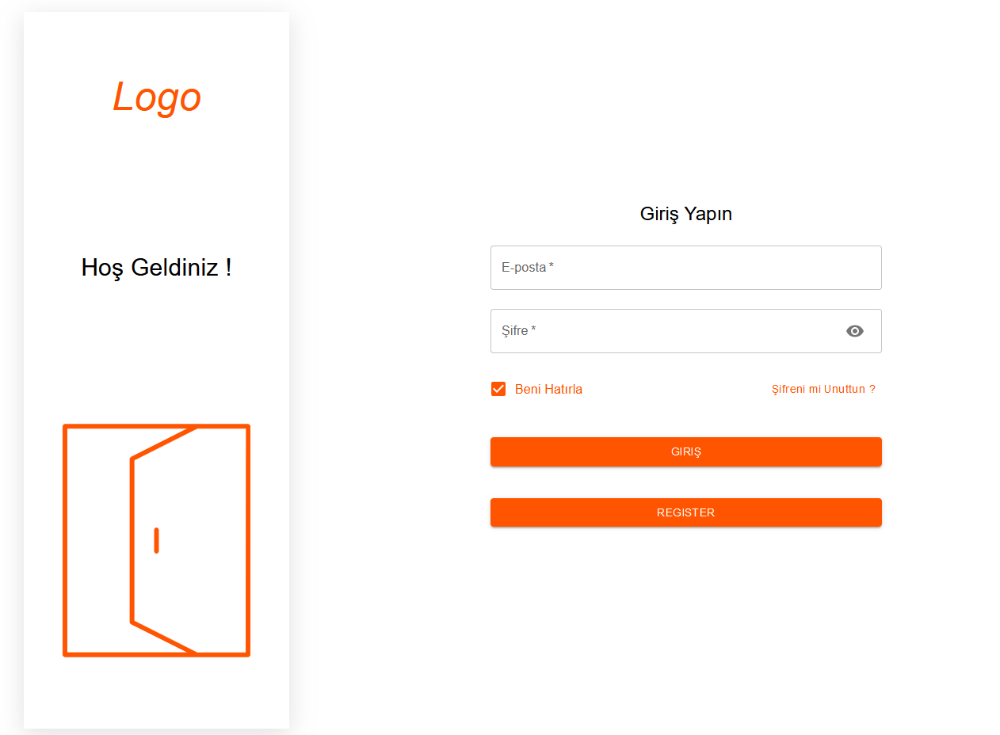
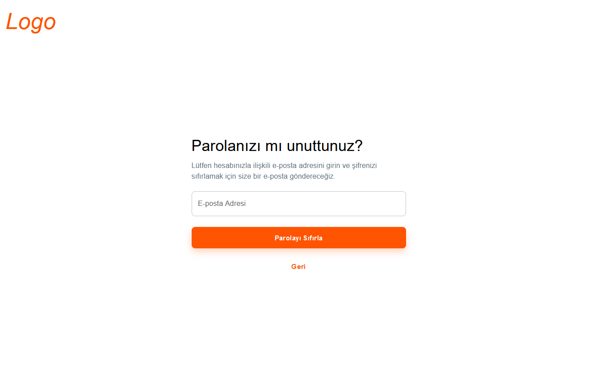
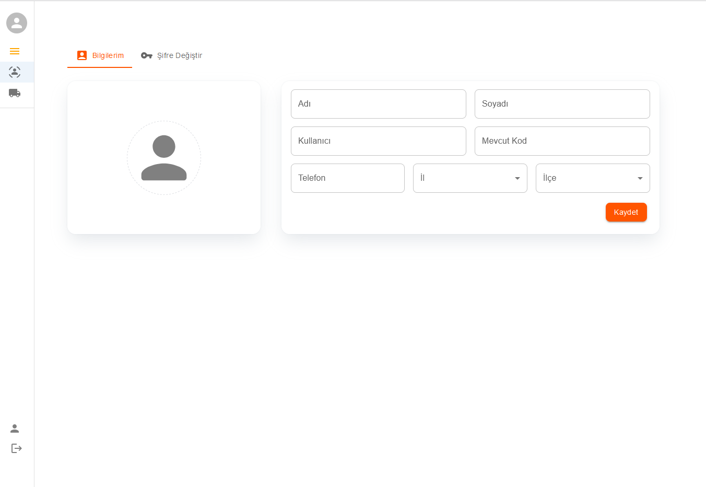

# Logistic Template

A simple template for logistic companies created using react, redux, and typescript.

<h2>Features:</h2>

- Nav-bar that 

- Responsive design for an optimal experience across devices 

- Upload photo

<h2>Technologies Used: </h2>

- <b>React:</b> For building the user interface.

- <b>Material-mui:</b> For responsive design and styling.

- <b>Redux:</b> Managing app state.

## Available Scripts

In the project directory, you can run:

### `npm start`

Runs the app in the development mode.\
Open [http://localhost:3000](http://localhost:3000) to view it in the browser.

The page will reload if you make edits.\
You will also see any lint errors in the console.

## Screenshots:

  
  
  

<a href="https://drive.google.com/file/d/1KgtlGxQDzS__DXgkkac-MjtCSE4xi-wc/view">Demo Video</a>
